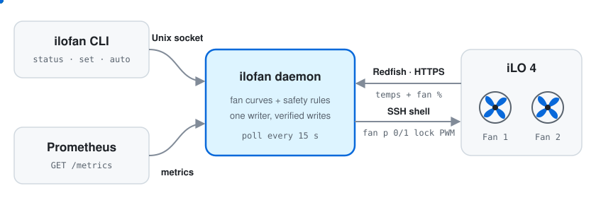

<div align="center">


[](go.mod)
[](docs/INSTALL.md#nixos)
[](https://github.com/kendallgoto/ilo4_unlock)
[](LICENSE)

Your HPE server does not need to sound like a jet engine.<br>
ilofan drives the fans from a temperature curve and checks every write it makes.

[Features](#features) · [Install](#install) · [Run](#run) · [Configure](docs/CONFIG.md)

</div>

---

HPE ProLiant servers with iLO 4 tend to run their fans far faster than the temperatures require. ilofan is a small daemon that reads the temperatures from the iLO, picks a speed from your fan curve, sets both fans, and reads them back to confirm the change.

> [!IMPORTANT]
> ilofan needs the patched iLO 4 firmware from [kendallgoto/ilo4_unlock](https://github.com/kendallgoto/ilo4_unlock), which adds fan commands to the iLO SSH shell. Follow that repository to flash it first. ilofan never touches firmware.

<p align="center">
  
</p>

## Features

- **Your fan curve.** Map temperatures to speeds per sensor, with as many points as you like.
- **Safe by default.** Warnings step the fans up. Danger, a missing sensor, or a failed read means 100 %.
- **Verified writes.** Every change is read back from the iLO. Mismatches and drift are corrected.
- **No flapping.** Speeds rise at once and fall only after several calm readings.
- **Guided setup.** `ilofan setup` asks a few questions, pins the iLO keys, tests the login, and writes the config.
- **Simple CLI.** Check status, hold a speed, or hand the fans back to the iLO.
- **Prometheus metrics** and a **NixOS module**.

Built and tested on a ProLiant ML310e Gen8 v2.

## Install

```sh
go install github.com/kevinpita/ilofan@latest
sudo install -m 755 "$(go env GOPATH)/bin/ilofan" /usr/local/bin/
```

To run it as a systemd service, or with the NixOS module, see [INSTALL.md](docs/INSTALL.md).

## Run

```sh
sudo ilofan setup      # writes /etc/ilofan/config.json and /etc/ilofan/password
```

`setup` asks for the iLO address, username, and password. It shows the iLO certificate and SSH key fingerprints for you to confirm, then tests both logins without touching the fans. It starts in `observe` mode, which only watches. Once `ilofan status` looks right, set `"mode": "control"`.

Start the daemon with your service manager ([INSTALL.md](docs/INSTALL.md)), then:

```console
$ ilofan status
mode      control, auto
level     healthy
fans      [10 10]% (target 11%, commanded 11%)
read      3s ago, 0 errors
write     2m14s ago, 0 errors
  01-Inlet Ambient    25.0 °C
  02-CPU              40.0 °C
  ...

$ ilofan set 30        # at least 30 %; temperatures can still raise it
$ ilofan auto          # follow the curve again
$ ilofan release       # hand the fans back to the iLO
```

## Configure

The config is a JSON file. Everything except the iLO details is optional. A quieter CPU curve looks like this:

```json
{
  "curves": {
    "02-CPU": [
      { "temp": 40, "percent": 9 },
      { "temp": 50, "percent": 20 },
      { "temp": 58, "percent": 45 }
    ]
  }
}
```

See [CONFIG.md](docs/CONFIG.md) for every setting, how ilofan picks a speed, and the metrics.

> [!NOTE]
> Stop any other script that sets iLO fan speeds before you switch to `control`. ilofan cannot see other writers.
