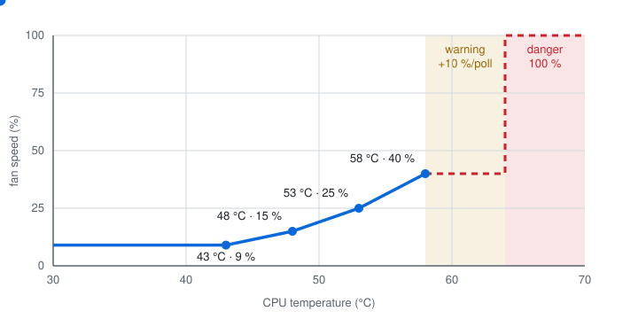

# Configuring ilofan

The config is a JSON file, `/etc/ilofan/config.json` by default. `ilofan setup` writes the iLO details for you. Everything else is optional, and the defaults live in [config.go](../config.go).

## How ilofan picks a speed

Every poll, ilofan reads the iLO thermal data and checks each sensor in `sensors` against its warning and danger thresholds. If the iLO reports a critical threshold, the limits are tightened to stay at least 5 °C below it.

| Condition | Fan speed |
| --- | --- |
| All sensors healthy | the highest curve value, never below `minimumPercent` |
| Any sensor at warning | the curve value or the fastest fan + 10, whichever is higher, on every poll until the warning clears |
| Any sensor at danger, missing, unhealthy, or a failed read | 100 % |

Speeds rise at once. They fall only after `lowerAfter` calm polls, and the lower speed must still be enough if every temperature were `hysteresis` °C higher. After every write, ilofan reads both fans back and treats a mismatch as a fault to retry.

When the daemon stops in `control` mode, it hands the fans back to the iLO firmware. A crash or a power loss cannot do that, so the last speed stays until something changes it.

## Curves

Each curve belongs to one sensor and lists temperature -> percent points. Between two points the speed is interpolated linearly. Below the first point and above the last, the end values hold. With several curves, the highest result wins.

<p align="center">
  
</p>

```json
"curves": {
  "02-CPU": [
    { "temp": 40, "percent": 9 },
    { "temp": 45, "percent": 12 },
    { "temp": 50, "percent": 20 },
    { "temp": 55, "percent": 30 },
    { "temp": 58, "percent": 45 }
  ],
  "01-Inlet Ambient": [
    { "temp": 24, "percent": 9 },
    { "temp": 30, "percent": 25 }
  ]
}
```

With this config, the CPU at 47.5 °C gives 16 %. A `curves` map replaces the defaults completely. Every curve needs a matching entry in `sensors`.

## Settings

| Key | Default | Meaning |
| --- | --- | --- |
| `host` | | iLO address |
| `username` | | iLO account. A dedicated iLO user is safer than `Administrator`. |
| `passwordFile` | | File containing only the iLO password. Group and others must not be able to read it. |
| `hostKey` | | iLO SSH public key, `ssh-rsa AAAA...`. Required in `control` mode. |
| `tlsFingerprint` | | SHA-256 fingerprint of the iLO HTTPS certificate |
| `insecureTLS` | `false` | Skip certificate checks instead of pinning |
| `mode` | `observe` | `observe` only watches, `control` sets the fans |
| `socket` | `/run/ilofan/ilofan.sock` | Control socket for the CLI |
| `metricsAddress` | off | Address for Prometheus `/metrics`, e.g. `:9877` |
| `releaseOnStop` | `true` | Hand the fans back to the iLO when the daemon stops |
| `pollSeconds` | `15` | Seconds between reads |
| `minimumPercent` | `9` | Lowest speed ilofan sets |
| `curves` | CPU 43 °C: 9 % to 58 °C: 40 %, inlet 24 °C: 9 % to 34 °C: 40 % | See [Curves](#curves) |
| `lowerAfter` | `6` | Calm polls before lowering |
| `hysteresis` | `3` | °C added to every reading when checking a lower speed |
| `tolerance` | `2` | Allowed difference in percent between target and readback |
| `sensors` | ML310e Gen8 v2 list | `{"02-CPU": {"warning": 58, "danger": 64}, ...}`. Replaces the default list when set. |

When systemd passes a credential named `password` (`LoadCredential=password:...`), the daemon uses it instead of `passwordFile`.

## Finding the iLO keys

`ilofan setup` reads both keys and asks you to confirm them. To get them by hand:

```sh
openssl s_client -connect ILO:443 </dev/null 2>/dev/null | openssl x509 -noout -fingerprint -sha256
ssh -o KexAlgorithms=+diffie-hellman-group14-sha1 -o HostKeyAlgorithms=+ssh-rsa ILO   # then copy the key from known_hosts
```

Check the keys against a source you already trust before you rely on them.

## Metrics

With `metricsAddress` set, `/metrics` exposes `ilofan_fan_percent`, `ilofan_temperature_celsius`, `ilofan_target_percent`, `ilofan_commanded_percent`, `ilofan_level` (0 healthy, 1 warning, 2 danger), `ilofan_control_fault`, `ilofan_last_read_timestamp_seconds`, `ilofan_last_write_timestamp_seconds`, and read and write error counters.

Disk temperatures are not read. Watch your drives separately, for example with smartd.
